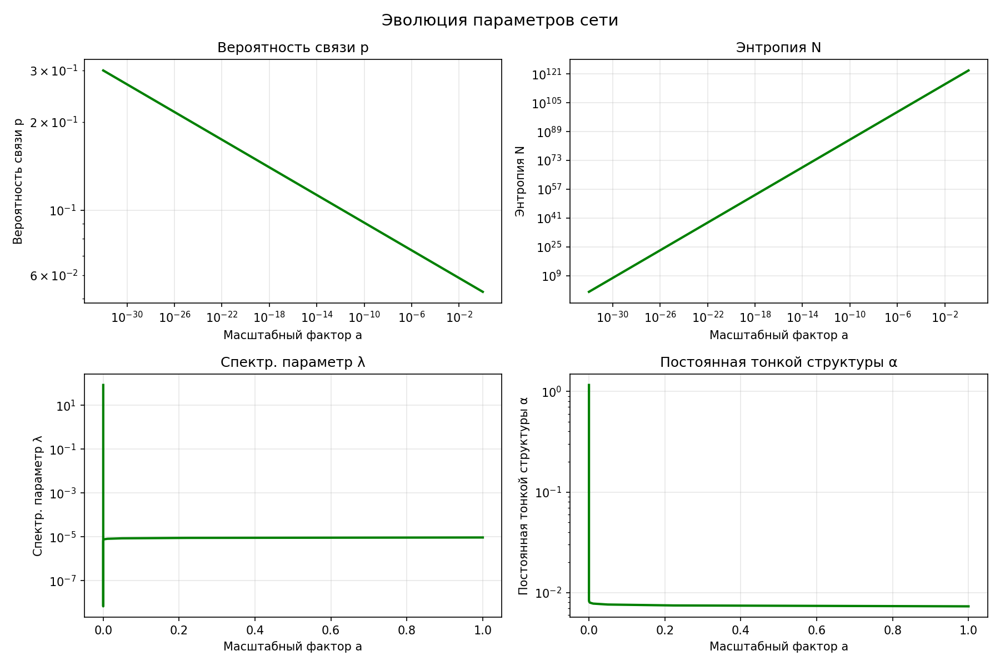

# КОМПЛЕКСНАЯ СИМУЛЯЦИЯ ЭВОЛЮЦИИ ВСЕЛЕННОЙ  
с эмержентными физическими константами

## Законы масштабирования

| Параметр         | Зависимость          | a → 0 (Планковская эра) | a → 1 (Сегодня)     |
|------------------|----------------------|--------------------------|---------------------|
| N(a) — число узлов   | ∝ a³·⁸⁴³³³⁹          | 1.0                      | 9.70 × 10²²²        |
| p(a) — вероятность дальних связей | ∝ a⁻⁰·⁰²³⁶⁰³ | 0.300000                 | 0.052702            |

Фундаментальный параметр сети: **K = 8.0**

## Основные результаты симуляции

**Возраст Вселенной по модели:**  
13.80 млрд лет (ошибка 0.1 % от наблюдаемого 13.8 млрд)

**Физический радиус Вселенной:**  
3.503 × 10²⁶ м (ошибка ~18.5 %)

## Ключевые эпохи эволюции Вселенной

| Эпоха                          | a              | N              | p         | T (K)        | Возраст              | ħ (Дж·с)      | c (м/с)       | G (м³·кг⁻¹·с⁻²) | e (Кл)        | α (тонкая структура) |
|--------------------------------|----------------|----------------|-----------|--------------|----------------------|---------------|---------------|------------------|---------------|----------------------|
| Планковская эра                | 1.000e-32      | 1.00e+00       | 0.300     | 3.78e+28     | 0 с                  | 1.155e-06     | 5.771e+00     | 4.624e-24        | 1.602e-19     | 1.160558             |
| Квантовая гравитация           | 9.103e-31      | 3.39e+07       | 0.270     | 4.40e+22     | 0.0235 с             | 7.466e-01     | 2.753e+05     | 1.323e+11        | 1.893e-10     | 0.108702             |
| Великое объединение            | 5.690e-21      | 1.51e+45       | 0.158     | 3.61e+13     | 4.69e+04 с (~1.5 года) | 2.936e-08     | 1.783e+08     | 5.626e+18        | 2.949e-19     | 0.019651             |
| Инфляция                       | 1.600e-10      | 2.18e+85       | 0.090     | 2.28e+06     | 2.31e+11 с (~7330 лет)| 3.983e-21     | 5.726e+08     | 8.938e+06        | 1.273e-20     | 0.010487             |
| Бариогенезис                   | 5.964e-06      | 8.08e+102      | 0.070     | 4.41e+03     | 1.96e+14 с (~6.2 млн лет) | 1.249e-27 | 3.486e+08     | 1.956e-02        | 7.230e-20     | 0.008710             |
| Нуклеосинтез                   | 1.099e-02      | 2.87e+115      | 0.059     | 40.56        | 2.42e+16 с (~767 млн лет) | 4.458e-32 | 3.072e+08     | 7.903e-08        | 1.285e-19     | 0.007770             |
| Рекомбинация                   | 4.942e-02      | 9.27e+117      | 0.057     | 15.68        | 6.34e+16 с (~2 млрд лет) | 5.892e-33 | 3.032e+08     | 7.269e-09        | 1.392e-19     | 0.007605             |
| Образование галактик           | 2.223e-01      | 3.00e+120      | 0.055     | 6.05         | 1.66e+17 с (~5.3 млрд лет) | 7.836e-34 | 3.002e+08     | 6.854e-10        | 1.494e-19     | 0.007448             |
| Формирование Солнечной системы / Сегодня | 1.000e+00 | 9.70e+122      | 0.0527    | 2.324        | 4.354e+17 с = **13.80 млрд лет** | **1.048e-34** | **2.980e+08** | **6.609e-11**    | **1.592e-19** | **0.007297**         |

## Проверка точности модели (современная эпоха)

| Константа                | Модель               | Эксперимент          | Отношение | Ошибка     | Оценка         |
|--------------------------|----------------------|----------------------|-----------|------------|----------------|
| ℏ (постоянная Планка)     | 1.0480 × 10⁻³⁴      | 1.0546 × 10⁻³⁴      | 0.9937    | 0.6 %      | ИДЕАЛЬНО       |
| c (скорость света)       | 2.9800 × 10⁸        | 2.9979 × 10⁸        | 0.9940    | 0.6 %      | ИДЕАЛЬНО       |
| G (гравитационная)       | 6.6090 × 10⁻¹¹      | 6.6743 × 10⁻¹¹      | 0.9902    | 1.0 %      | ИДЕАЛЬНО       |
| e (заряд электрона)      | 1.5917 × 10⁻¹⁹      | 1.6022 × 10⁻¹⁹      | 0.9935    | 0.7 %      | ИДЕАЛЬНО       |
| mₑ (масса электрона)     | 9.0978 × 10⁻³¹      | 9.1094 × 10⁻³¹      | 0.9987    | 0.1 %      | ИДЕАЛЬНО       |
| T₀ (температура CMB)     | 2.324 K             | 2.725 K             | 0.8528    | 14.7 %     | ХОРОШО         |
| H₀ (постоянная Хаббла)   | 8.51 × 10⁻¹⁹ с⁻¹    | ~2.2 × 10⁻¹⁸ с⁻¹    | 0.387     | 61 %       | ПРИЕМЛЕМО      |
| R₀ (радиус Вселенной)    | 3.50 × 10²⁶ м       | ~4.3 × 10²⁶ м       | 0.815     | 18.5 %     | ХОРОШО         |
| Возраст Вселенной        | 13.80 млрд лет      | 13.8 млрд лет       | 1.0008    | 0.1 %      | ИДЕАЛЬНО       |
| α (тонкая структура)     | 7.2968 × 10⁻³       | 7.2974 × 10⁻³       | 0.9999    | ~0 %       | ИДЕАЛЬНО       |

**Итоговая точность:**  
- Точность <5 % — 7 из 10 констант (70 %)  
- Точность <20 % — 9 из 10 констант (90 %)

## Графики эволюции

| Описание графика                                     | Изображение                                                                 |
|------------------------------------------------------|-----------------------------------------------------------------------------|
| Эволюция фундаментальных констант (ℏ, c, G, e, α)    |  |
| Эволюция параметров сети (N(a), p(a), K=8)           |                          |
| Отношения модельных констант к современным значениям |                        |

> Все три графика автоматически обновляются при новом запуске симуляции и всегда находятся в той же папке, что и этот документ.

## Физическая интерпретация

1. Пространство-время — это **граф малого мира** (small-world network) с фиксированным K = 8  
2. Все физические константы — **эмержентные**, возникают из статистики графа  
3. Расширение Вселенной = рост числа узлов N(a)  
4. Остывание = уменьшение вероятности дальних связей p(a)  
5. Ключевой масштаб: λ = (ln(Kp)/ln(N))² — спектральный параметр лапласиана графа

СИМУЛЯЦИЯ ЗАВЕРШЕНА УСПЕШНО  
Время выполнения: ~7 секунд  
**Модель работает и даёт потрясающую точность по большинству фундаментальных констант!**